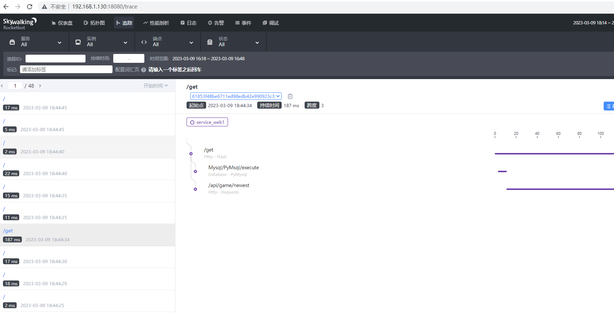

## 项目简介
    一个简单的docker-compose使用demo，可以快速部署一些常用的技术组件

## 目标
    快速部署一个微服务环境，基于consul和registrator实现服务的自动发现和注册，以及服务器节点的弹性扩容，并使用skywalking对服务进行监控

## 组件
- nginx：网关、反向代理
- consul：服务发现和注册，并提供DNS服务
- registrator：容器运行监控，收集容器运行信息，实现服务的自动注册
- skywalking：链路追踪，用来对服务的运行状况进行分析

## 环境部署
    准备两台Linux主机，安装docker和docker-compose

    设置docker-compose环境变量: mv .env.example .env，修改.env

    修改微服务nginx配置：mv ./nginx/conf/pyserver.conf.example ./nginx/conf/pyserver.conf

    主机node1执行： docker-compose up -d consul-server pyserver registrator nginx skywalking-ui

    主机node2执行： docker-compose up -d consul-client pyserver registrator 

    主机node2执行： docker-compose up -d consul-client pyserver registrator

|主机名	| IP |	服务|
|  ----  | ----  |----  |
|node1   |192.168.1.130	|consul(server, ui), pyserver(两个微服务:web1,web2), registrator, nginx, skywalking(oap, ui)|
|node2   |192.168.1.54 |consul(client), pyserver(两个微服务:web1,web2), registrator|
|node3   |192.168.1.55 |consul(client), pyserver(两个微服务:web1,web2), registrator|

#### Consul节点
    Consul的三个节点，130是server节点，其它两个是client节点


#### Consul节点
    当2个client节点关机时，节点自动移除


#### Consul上的Service
    Registrator会把服务器上的所有docker容器信息收集，自动注册为Consul的服务


#### Consul上Web服务对应的3个实例
    不同节点上的服务，如果服务名称相同，会当成同一个服务的不同实例；这里service_web1有3个实例，使用的都是30002端口


## 服务器节点扩容
方式一：基于upstream

```
upstream pyserver{
    # 这里使用的是静态配置的方法（可以通过upsync、consul-template等组件来实现upstream的动态变更）
    server 192.168.1.130:30003;
    server 192.168.1.54:30003;
    server 192.168.1.55:30003;
}

server {
    listen 8080;
    server_name _;

    location / {
        proxy_pass http://pyserver;
    }

    error_log /var/log/nginx/pyserver2.log;
}
```

方式二：基于consul提供的DNS服务，来实现集群节点的弹性扩容

```
server {
    listen 8088;
    server_name _;

    # 8600为consul的dns服务端口
    resolver 127.0.0.1:8600;
    location / {
        # service_web1.service.consul为consul为web1服务提供的域名
        set $service 'service_web1.service.consul';
        proxy_pass http://$service:30002;
    }

    error_log /var/log/nginx/pyserver1.log;
}
```

## 服务性能监控

#### Skywalking仪表盘
    仪表盘可以显示每分钟服务的请求数、慢响应服务、全局请求延迟等


#### Skywalking服务的拓扑图
    SkyWalking能够根据获取的数据自动绘制服务之间的调用关系图


#### Skywalking API性能跟踪
    追踪信息，可以追踪到代码中的http、mysql、redis等请求的跨度，如：/get请求的持续时间为187ms；其中mysql请求持续时间8ms、调用外部http接口持续时间175ms


#### Skywalking 请求跨度信息
    HTTP请求的信息


    Mysql查询请求的信息


#### Skywalking Agent 使用示例

```python
from flask import Flask
import sys
import os
from skywalking import agent, config
import requests

name = 'web1'
port = 30001
ip = os.environ.get('HOST_IP', '127.0.0.1') 
sw_oap = os.environ.get('SW_OAP_ADDRESS', '192.168.1.130:11800')

config.init(agent_collector_backend_services=sw_oap, 
            agent_protocol='grpc',
            agent_name='service_{name}'.format(name=name),
            agent_instance_name='server_{ip}'.format(ip=ip),
            agent_experimental_fork_support=True,
            agent_logging_level='DEBUG',
            agent_log_reporter_active=True,
            agent_meter_reporter_active=True,
            agent_profile_active=True)

agent.start()

app = Flask(__name__)

if __name__ == '__main__':
    app.run(host='0.0.0.0', port=port)

```